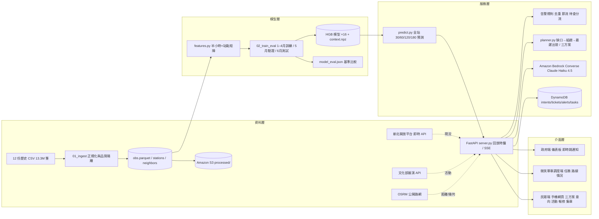

# 技術架構

## 資料流與時間一致性
- 回放時鐘每一步代表一個半小時快照；所有預測只使用該時點（含）以前的觀測與日曆資訊，t+h 的時段／假日可預知故允許。
- 正式回測保留原始時間戳；半小時分箱只是對齊，不代表資料發布時間。
- 容量矛盾（可借＋可還＞總車柱）10,468 筆隔離不修改；雙零、24 小時無變化列為「待查」，不轉派車。

## 預測
- 目標：t+30／60／120／180 的可借、可還（回歸變化量）與零車／零位機率（分類）。
- 特徵：現況、落後值、變化量、日型時段、訓練期站點日型時段輪廓（平均與零車／零位比例）、日型漂移基準值、鄰站 500 m 合計、無變化步數、行政區。
- 基準：持續值、日型輪廓、持續值＋日型漂移。指標：MAE、PR-AUC、新事件召回／精確、precision@k、校準、分區（捷運／學校／尖峰）與排除長期不變後的敏感度。詳見 reports/model_eval.md。

## 政府端規則
- 預警：60 分零車／零位機率 ≥0.6（高）、120／180 分 ≥0.5（預警）。持續：連續 ≥90 分無車／無位（高）。待查：雙零、24 小時無變化、容量矛盾。
- 去重：同站同類型開啟中不重發；節流：每步最多 8 則，其餘併入摘要；自動解除：條件消失。
- 顯示原始預測、含意向修正、預期分流與剩餘缺口；反應速度以「發現→確認」時間紀錄（demo 內部）。

## 調度端排程（可行建議，非最優解）
- 每小時針對重點三區（板橋、新莊、土城）以 120／180 分尺度計算缺口：need_in＝目標最低庫存－預測可借（零車機率 ≥0.35 才計）；need_out 同理；供給站保留 max(最低庫存, 50% 容量)。
- 貪婪最近鄰組趟：先取（運出／供給／必要時調度中心補給），再送；載量 20、市區 20 km/h、每站 4 分＋0.4 分/輛。
- 時間：最遲出發＝目標時間－到第一送站時間；最早抵達＝現在＋60 分前置＋路程；來不及則標示改以在勤資源與民眾分流。
- 防止頻繁重排：已出車任務鎖定其送站；未出車任務若被新建議取代，保留原因；缺口摘要顯示派車可補與剩餘。

## 民眾端三方案
- 候選：起點步行上限內借車站 ×目的地步行上限內還車站，需往目的地推進且騎乘 ≥400 m。
- 每組合：步行→借（到站零車機率、預估車數）→騎→還（零位機率、預估空位）→步行；風險罰時＝(p 零車＋p 零位)×10 分。
- 最快＝總時間最短；較穩＝總時間＋2.5×罰時最小且風險 ≤0.3 優先；順路集點＝風險 ≤0.4 且供需效益（從將滿站借、還到將缺站、避開熱點）最高且不比最快多 10 分。
- 意向登記為配額不是預約；修正預測時只加本服務登記的淨意向×0.7，不重複計算歷史需求。

## 生成式 AI 分工（Bedrock）
只用於：推薦理由、調度簡報、主管摘要、工單／活動文本整理。系統提示禁止新增數字；失敗退回模板並標示。數量、風險、派車、獎勵由可驗證模型與規則計算。
